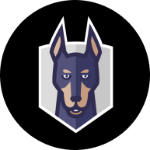

# Demo Snyk html reports, Snyk Container scan and Snyk Code #

There is an official add-on feature for Snyk to programmatically create HTML reports.

### This repository is for a basic interactive demo to showcase this feature. ###

We will do 2 things in this demo, create a Snyk html report and fix a vulnerability.

* Install the necessary prerequisites.
* Create a dockerfile, you can use the prepared one.
* Create a shell script, you can use the prepared one.
* Create some logic inside the shell script to build a container based on the dockerfile, this is already done.
* Create some logic in the shell script to scan the container image for security vulnerabilities with Snyk, this is already done.
* Create some logic in the shell script to output and open the scan results in an HTML page, this is already done.

* The second part is how to use Snyk code local to scan for secrets like keys, credentials, and sensitive information in your source code. We output the html report and check the results. If a vulnerability is found in this demo we have to find and fix that vulnerability.

### How do I get started? ###

* You need a laptop/macbook or pc/mac with an IDE like Intellij or VSCode or any other IDE you prefer.
* A working internet connection.
* Grab the source code from GitHub: git clone https://github.com/RobertoTorino/blog-snyk-reporting.git

**Instructions for part 1:**
* Install the [latest Snyk CLI](https://github.com/snyk/cli/releases): `npm i -g snyk@latest && snyk version`
* Install the [Snyk HTML tool](https://github.com/snyk/snyk-to-html/releases): `npm i -g snyk-to-html@latest`
* Use the shell script `Docker-build.sh` and create a docker container based on the dockerfile. The script will scan the container for vulnerabilities and output the report.
* Check the report and try to find the quickest way to fix most of the vulnerabilities.

**Instructions for part 2:**
* Run snyk code in the root of your project and output the report. You can use the shell script for that: `snyk-code-test.sh`
* Check the report and fix the vulnerability.

* It could be that the source code is not complete it’s up to you to make it work.

### Reference ###
 
* [How to install the Snyk-to-Html tool](https://docs.snyk.io/scan-application-code/snyk-code/cli-for-snyk-code/displaying-the-cli-results-in-an-html-format-using-the-snyk-to-html-feature/installing-the-snyk-to-html-tool)
* [How to run a Snyk container test](https://docs.snyk.io/snyk-cli/commands/container-test)

